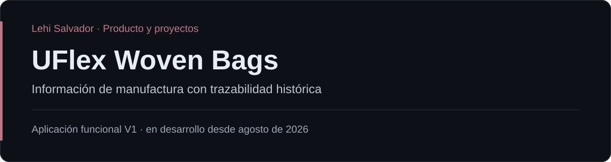

# UFlex Woven Bags

Proyecto industrial para digitalizar y estructurar información de manufactura en una operación de bolsas tejidas. Organiza registros diarios para que puedan consultarse históricamente y servir como base para análisis y mejora de procesos.

## Participación

Lehi Salvador — trabajo en estructuración de información operativa, definición de interfaz y desarrollo de la aplicación V1.

## Alcance

- Producción diaria.
- Desperdicio y detalle del desperdicio.
- Tiempos de paro.
- Trazabilidad histórica de registros.
- Interfaz sencilla basada en tablas operativas, semejante a Excel.

## Estado y contexto

Desde agosto de 2026. Existe una **aplicación funcional V1 en C#/.NET/WPF** y el proyecto continúa en desarrollo. Este repositorio presenta alcance funcional, enfoque de interfaz y contexto del proyecto.

## Tecnologías

C#, .NET y WPF.

## Enlaces

- [Portafolio de Lehi Salvador](https://github.com/LehiSalvador)
- [Salva Systems](https://salvasystems.site)

## Documentación de producto

[Contexto y alcance](docs/overview.md) · [Hoja de ruta pública](docs/roadmap.md)
